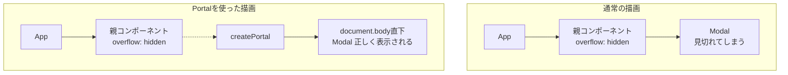
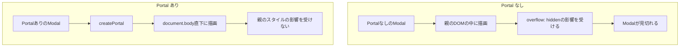
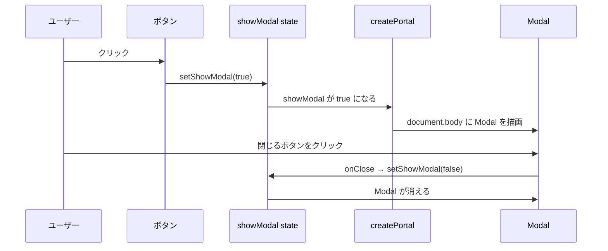
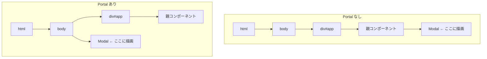

# Portal と Modal

## Portal とは

`createPortal` を使うと、コンポーネントのJSXを **DOMツリーの別の場所に描画**できます。
通常、子コンポーネントは親のDOMの中に描画されますが、Portalを使うと親の外（例：`document.body` 直下）に描画できます。

---

## なぜ Portal が必要か

Modalを親コンポーネントの中に普通に描画すると、親に `overflow: hidden` や `z-index` が設定されている場合に**Modal が見切れてしまう**問題が起きます。



---

## createPortal の基本

```tsx
import { createPortal } from 'react-dom'

createPortal(描画したいJSX, 描画先のDOM要素)
```

| 引数 | 説明 |
|---|---|
| 第1引数 | 描画したいJSX（Reactコンポーネント） |
| 第2引数 | 描画先のDOM要素（例：`document.body`） |

---

## Portal なし vs Portal あり



```tsx
// Portal なし：親のDOMの中に描画される
function NoPortalExample() {
  const [showModal, setShowModal] = useState(false)
  return (
    <>
      <button onClick={() => setShowModal(true)}>モーダルを開く</button>
      {showModal && <Modal onClose={() => setShowModal(false)} />}
    </>
  )
}

// Portal あり：document.body 直下に描画される
function PortalExample() {
  const [showModal, setShowModal] = useState(false)
  return (
    <>
      <button onClick={() => setShowModal(true)}>モーダルを開く</button>
      {showModal && createPortal(
        <Modal onClose={() => setShowModal(false)} />,
        document.body
      )}
    </>
  )
}
```

---

## Modal の実装例

Portalを使ったModalの全体像です。



```tsx
import { useState } from 'react'
import { createPortal } from 'react-dom'

// Modalコンポーネント（表示内容）
type ModalProps = {
  onClose: () => void
}

const Modal = ({ onClose }: ModalProps) => {
  return (
    <div style={{
      position: 'fixed',
      top: 0,
      left: 0,
      width: '100%',
      height: '100%',
      background: 'rgba(0,0,0,0.5)',
      display: 'flex',
      alignItems: 'center',
      justifyContent: 'center',
    }}>
      <div style={{ background: 'white', padding: '24px', borderRadius: '8px' }}>
        <p>モーダルの内容</p>
        <button onClick={onClose}>閉じる</button>
      </div>
    </div>
  )
}

// 親コンポーネント
const App = () => {
  const [showModal, setShowModal] = useState(false)

  return (
    <div>
      <button onClick={() => setShowModal(true)}>モーダルを開く</button>

      {showModal && createPortal(
        <Modal onClose={() => setShowModal(false)} />,
        document.body
      )}
    </div>
  )
}
```

---

## DOM上の構造の違い



Portalを使うと、ReactのコンポーネントツリーとDOMのツリーが**別の構造**になります。
Reactのイベントバブリングはコンポーネントツリーに従うので、Portal内のイベントも親コンポーネントで受け取れます。

---

## Portalを使うべき場面

| 用途 | 理由 |
|---|---|
| Modal / ダイアログ | 全画面オーバーレイが必要なため |
| Tooltip | 親の `overflow: hidden` の影響を避けるため |
| ドロップダウンメニュー | z-index の競合を避けるため |
| Toast通知 | 画面の固定位置に表示するため |

---

## ポイントまとめ

- `createPortal` は **描画先のDOMを変えるだけ**で、Reactのコンポーネントツリーの親子関係は変わらない
- 親に `overflow: hidden` や `z-index` があっても影響を受けない
- Modalやオーバーレイ系のUIには積極的に使う
