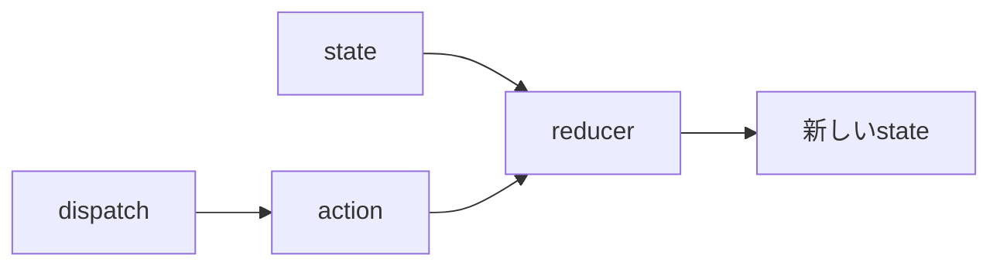
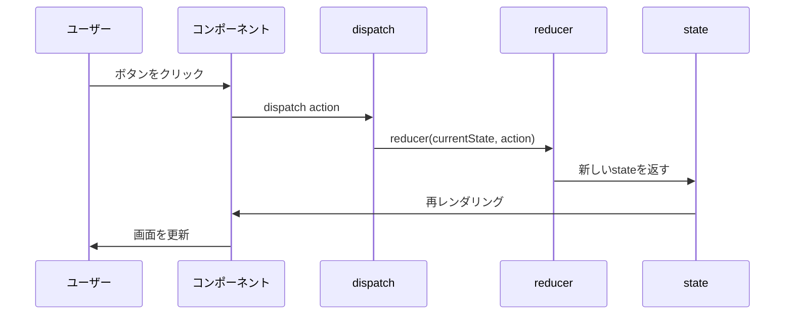
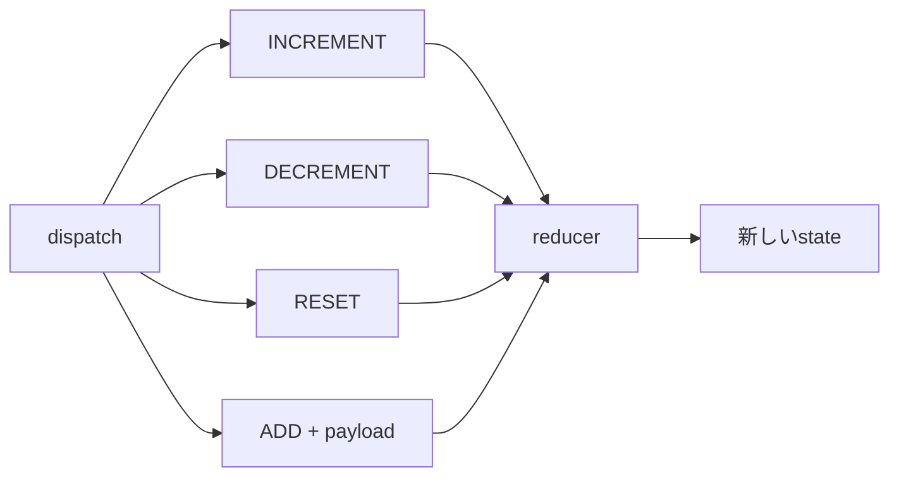
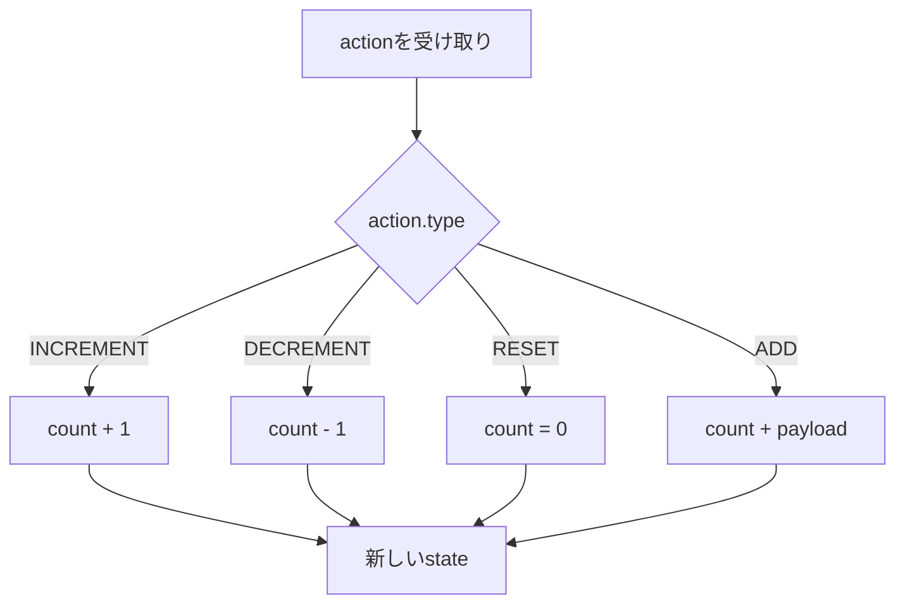
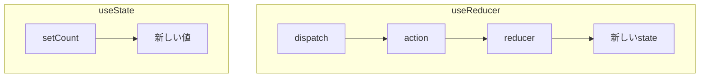
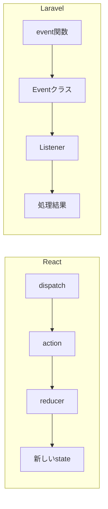
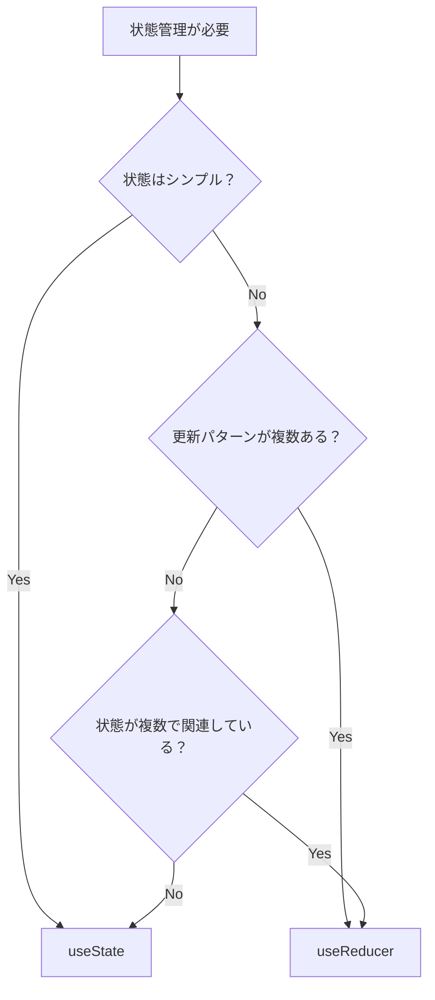

# useReducer

`useState` の強化版で、複雑な状態管理に使うReactフックです。
「何をするか（action）」と「どう変わるか（reducer）」を分離することで、更新ロジックが整理されます。

---

## 登場人物

useReducer には4つの登場人物がいます。

| 用語 | 役割 |
|---|---|
| `state` | 現在の状態（表示に使うデータ） |
| `action` | 「何をするか」の命令（`type` で種類を指定） |
| `reducer` | `state` と `action` を受け取り、新しい `state` を返す関数 |
| `dispatch` | `action` を送り出す関数（これを呼ぶと状態が更新される） |



---

## 全体の流れ

ボタンを押してから画面が更新されるまでの流れです。
`dispatch` を呼ぶと `reducer` が動き、新しい `state` が作られて画面が更新されます。



---

## actionの種類

`action` は `type` で種類を指定します。値を一緒に渡したい場合は `payload` に入れます。
`dispatch` は「どの action を実行するか」を `reducer` に伝える役割です。



```tsx
dispatch({ type: 'INCREMENT' })           // +1する
dispatch({ type: 'DECREMENT' })           // -1する
dispatch({ type: 'RESET' })               // 0に戻す
dispatch({ type: 'ADD', payload: 10 })    // 10加算する
```

---

## reducer の中身

`reducer` は `action.type` によって処理を分岐します。
**必ず新しいオブジェクトを返す**のがポイントです（stateを直接書き換えない）。



```tsx
const reducer = (state: State, action: Action): State => {
  switch (action.type) {
    case 'INCREMENT':
      return { count: state.count + 1 }
    case 'DECREMENT':
      return { count: state.count - 1 }
    case 'RESET':
      return { count: 0 }
    case 'ADD':
      return { count: state.count + action.payload }
    default:
      return state
  }
}
```

---

## useState との違い

`useState` は値を直接セットしますが、`useReducer` は「何をするか」を `dispatch` で伝えます。
更新パターンが増えるほど `useReducer` の方が整理しやすくなります。



```tsx
// useState：値を直接セット
setCount(count + 1)

// useReducer：何をするかを伝える
dispatch({ type: 'INCREMENT' })
```

---

## Laravelのイベントとリスナーとの対比

構造がLaravelのイベント＆リスナーにとても近いです。



| React | Laravel |
|---|---|
| `dispatch` | `event()` |
| `action` | Eventクラス |
| `reducer` | Listenerクラス |
| 新しい `state` | 処理結果 |

---

## useState vs useReducer 使い分け



| 状況 | おすすめ |
|---|---|
| 値が1〜2個のシンプルな管理 | `useState` |
| 更新パターンが複数ある（ADD/REMOVE/RESET等） | `useReducer` |
| 複数の状態が関連している | `useReducer` |
| 更新ロジックをコンポーネントから分離したい | `useReducer` |
